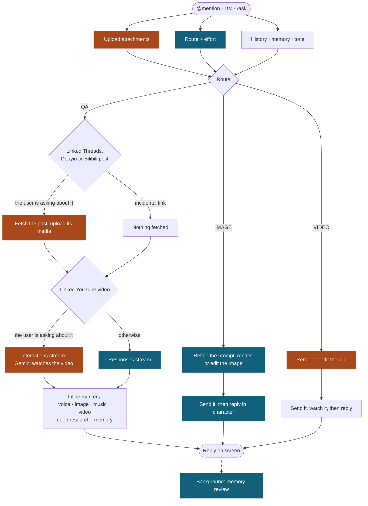

# AI-Powered Discord Bot

**English** | [**繁體中文**](./README.zh-TW.md) | [**简体中文**](./README.zh-CN.md)

A self-hosted Discord bot for AI chat, image and video generation, Threads link expansion, video downloads, virtual currency, and casino mini-games. It runs on nextcord, stores runtime data in local SQLite files, and talks to an OpenAI-compatible LLM endpoint such as LiteLLM.

## Showcase

Mention the bot and ask what it can do. There is no help command; it answers from its own capability reference, in the language you asked in.

Ask for a picture and it generates one, then replies about it in character.

Ask it to animate that same picture and it returns a short video.

## How a reply happens

Every mention, DM, and `/ask` runs the same pipeline. Exactly one triage call sits on the critical path and picks the route; everything else is either prepared in parallel before that decision lands or runs after the answer text is already on screen.

Blue steps run on the OpenAI-compatible proxy; orange ones call Google directly, which is what the Gemini Files API, watching a YouTube video, and native video and music generation each require.

The two content branches cost nothing when they do not apply. A linked post is fetched only when the router judges the user is asking about it, so an incidental link downloads nothing at all; and watching a YouTube video is the one thing that moves an answer turn onto the direct path, because the proxy fetches the link as a web page and the model never sees the footage. Everything after the answer text lands is best-effort: a clip that fails to render leaves the reply standing and adds only a small hint.

## Features

- **AI chat**: mention the bot in a server or send a DM. It can answer questions, summarize recent chat, inspect supported attachments, watch a linked YouTube video, generate or edit images, generate short videos from a prompt or attached images, edit a referenced video, continue long replies as follow-up reply messages, and use model-provided web tools when available. It also builds a private per-user long-term memory of your preferences in the background — privacy-scoped by source, so something told in one server never surfaces in another (only your tone preferences and clearly harmless general facts carry over) — manageable with `/memory show`, `/memory regenerate`, and `/memory clear`. You can also just ask it to remember something, or tell it that something it remembers is wrong, and a short note under its reply says what it took down.
- **Threads parser**: paste a Threads.net or Threads.com URL and the bot expands the post, media, and reply chain, plus the post it quotes when it is a quote post. Mention the bot alongside the link instead, or mention it in a reply to a message carrying one, and it reads the post together with the comments under it and answers about it.
- **Douyin parser**: paste a Douyin link and the bot posts the video (or the photo post's images) straight into the channel. Mention the bot alongside the link instead and it watches the clip and answers about it.
- **Bilibili Q&A**: mention the bot with a Bilibili video link and it watches the video and answers about it. A bare link is not auto-expanded; `/download_video` still downloads the file.
- **Video downloader**: `/download_video` downloads videos from YouTube, TikTok, Instagram, X, Facebook, Bilibili, and other yt-dlp supported sites. Douyin is supported too, watermark free and including photo posts. Files too large to upload are served as a link instead.
- **Virtual currency and finance**: users earn 虛擬歡樂豆 from messages, can transfer balances, buy VIP, use long-term personal credit or central-bank loans, and view leaderboards.
- **Casino games**: multiplayer `/games blackjack` and `/games dragon_gate` lobbies. Blackjack is dealt by the casino system (deterministic H17), the bot itself joins each round as a player driven by its own deterministic strategy (fractional-Kelly betting and EV-based play), and `/casino` / `/pocat` surface the casino ledger and the bot's wallet.
- **Localized commands**: slash command metadata is localized for English, Traditional Chinese, and Japanese. AI replies follow the user's language. There is no help command: ask the bot what it can do and it answers from a single English capability reference, translated into whatever language you asked in.

## Commands

| Command                                     | What it does                                                                                                                                     |
| ------------------------------------------- | ------------------------------------------------------------------------------------------------------------------------------------------------ |
| `@bot <message>`                            | Chat with the AI. Attach supported files or images when you want the bot to inspect them.                                                        |
| _Threads URL_                               | Automatically expands Threads posts and media, unless the bot is mentioned (then it answers about the comments too).                             |
| `/clean_threads_url <url>`                  | Privately turns a Threads share link into the post's own URL, so passing it on no longer names whoever shared it.                                |
| _Douyin URL_                                | Automatically posts the video or photos, unless the bot is mentioned (then it answers about it).                                                 |
| _Bilibili URL + mention_                    | Watches the linked video and answers about it (a bare link is not auto-expanded).                                                                |
| `/download_video <url> [quality]`           | Downloads a video and sends it back to Discord. A Douyin photo post comes back as images.                                                        |
| `/balance [member]`                         | Privately shows a member's 虛擬歡樂豆 balance, debt, net worth, and VIP status.                                                                  |
| `/vip`                                      | Buys permanent VIP perks.                                                                                                                        |
| `/leaderboard`                              | Shows the global top balances.                                                                                                                   |
| `/loss_leaderboard`                         | Shows today's accumulated casino losses.                                                                                                         |
| `/credit status\|borrow\|call\|repay`       | Handles personal credit requests, 180-second approval/rejection/cancel buttons, repayment, collection, and status.                               |
| `/central_bank status\|borrow\|call\|repay` | Handles central-bank loan requests, 180-second approval/rejection/cancel buttons, repayment, collection, and capacity.                           |
| `/give <member> <amount>`                   | Transfers 虛擬歡樂豆 to another member or bot.                                                                                                   |
| `/admin refund_tax\|collect_tax`            | Manual balance adjustments for members or bots; gated on the `economy admin` account flag, not on a Discord role.                                |
| `/games blackjack <bet>`                    | Opens a multiplayer Blackjack lobby; `bet` accepts comma-formatted numbers, and `0` means all in.                                                |
| `/games dragon_gate`                        | Opens a multiplayer 射龍門 table backed by the shared jackpot pool.                                                                              |
| `/casino`                                   | Shows the casino system's cumulative profit and loss.                                                                                            |
| `/pocat`                                    | Shows the bot player's own wallet (shortcut for `/balance @bot`).                                                                                |
| `/memory show\|regenerate\|clear`           | Privately shows, rebuilds, or erases what the bot remembers about you; regenerate runs in the background, and clear asks for confirmation first. |
| `/ping`                                     | Checks bot latency.                                                                                                                              |

## Development

Contributor setup, code conventions, tests, and release notes live in [CONTRIBUTING.md](./.github/CONTRIBUTING.md).

[Documentation](https://mai0313.github.io/discordbot/) | [Report a Bug](https://github.com/Mai0313/discordbot/issues) | [Discussions](https://github.com/Mai0313/discordbot/discussions)

