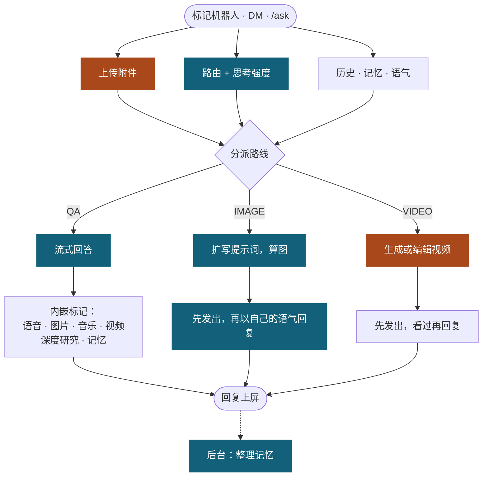

# AI 智能 Discord 机器人

[**English**](./README.md) | [**繁體中文**](./README.zh-TW.md) | **简体中文**

一个自托管 Discord 机器人，提供 AI 聊天、图片与视频生成、Threads 链接展开、视频下载、虚拟欢乐豆与赌场小游戏。它基于 nextcord 运行，用本地 SQLite 保存 runtime data，并连接 OpenAI-compatible LLM endpoint，例如 LiteLLM。

## 功能展示

标记机器人并问它会做什么。这里没有 help 指令，它会读自己的功能说明，并用你提问的语言回答。

叫它画一张图，它会直接生成，并以自己的语气回复。

再叫它把同一张图动起来，它会返回一小段视频。

## 一条回复是怎么跑的

每一次标记、DM 与 `/ask` 都走同一条流水线。关键路径上只有一支 triage 调用，由它决定路线；其他工作不是在那个决定之前就并行准备好，就是等回复文字已经上屏之后才跑。

蓝色的步骤走 OpenAI-compatible proxy，橙色的直接调用 Google，因为 Gemini Files API、原生的视频与音乐生成，以及深度研究都只有直连这条路。观看贴上的 YouTube 视频时，那一轮回答也会改走直连，因为 proxy 会把链接当成普通网页抓下来，模型永远看不到视频本身。

贴上的 Threads、抖音或 Bilibili 帖子，只有在 triage 判断用户真的在问它的内容时才会去抓，所以顺手贴的链接不花任何成本。回复文字落地之后的每一件事都是尽力而为：某段媒体算失败只会让回复照样留着，并多一个小提示。

## 功能

- **AI 聊天**：在 server 标记机器人或发送 DM。它可以回答问题、总结近期聊天、检查支持的附件、观看贴上的 YouTube 视频、生成或编辑图片、用提示或附加图片生成短视频、编辑引用的视频、以接续 reply 消息延续长回复，并在可用时使用 model-provided web tools。它还会在后台慢慢积累对你个人偏好的长期记忆（仅自己可见，且按来源做隐私隔离：在某个服务器说的私事不会出现在别的服务器，只有语气偏好与明显无害的一般事实会跨服务器沿用），可用 `/memory show`、`/memory regenerate` 与 `/memory clear` 管理。你也可以直接叫它记住某件事，或告诉它记错了，回复下方会有一行小字说明它记下了什么。
- **Threads 解析**：贴上 Threads.net 或 Threads.com URL，机器人会展开贴文、媒体与 reply chain，引用别人或自己先前的贴文时也会一起带出被引用的那篇；改成 tag 机器人并附上链接，或是回复别人贴链接的消息时 tag 机器人，它会改为连底下的留言一起读过再回答。
- **抖音解析**：贴上抖音链接，机器人会直接把视频（或图文贴文的图片）传到频道；改成 tag 机器人并附上链接，它会改为看过视频再回答。
- **Bilibili 问答**：tag 机器人并附上 B 站视频链接，它会看过视频再回答。单独贴链接不会自动展开；`/download_video` 仍可下载文件。
- **视频下载**：`/download_video` 可从 YouTube、TikTok、Instagram、X、Facebook、Bilibili，以及其他 yt-dlp 支持的网站下载视频。抖音也支持，无水印且包含图文贴文。文件太大无法上传时会改以链接提供。
- **虚拟欢乐豆与金融系统**：用户可从消息获得虚拟欢乐豆，可转账、购买 VIP、使用长期个人信贷或央行借款，并查看排行榜。
- **赌场游戏**：多人 `/games blackjack` 与 `/games dragon_gate` lobby。Blackjack 庄家改为赌场系统 (deterministic H17)，bot 本身会以玩家身份入桌并由独立的确定性策略 (fractional-Kelly 下注与 EV 决策) 决策，`/casino` 与 `/pocat` 分别显示赌场账本与 bot 玩家钱包。
- **本地化指令**：slash command metadata 支持英文、繁体中文、日文。AI 回复会跟随用户语言。没有 help 指令：直接问 bot 会做什么，它会读一份英文的功能说明并用你提问的语言回答。

## 指令

| 指令                                        | 功能                                                                                   |
| ------------------------------------------- | -------------------------------------------------------------------------------------- |
| `@bot <message>`                            | 和 AI 聊天。需要机器人检查文件或图片时，可附上支持的附件。                             |
| _Threads URL_                               | 自动展开 Threads 贴文与媒体；被 tag 时改为连留言一起读过再回答。                       |
| _抖音 URL_                                  | 自动传回视频或图片；被 tag 时改为看过视频再回答。                                      |
| _Bilibili URL + tag_                        | 看过链接的视频后回答（单独贴链接不会自动展开）。                                       |
| `/download_video <url> [quality]`           | 下载视频并传回 Discord。抖音的图文贴文会传回图片。                                     |
| `/balance [member]`                         | 私密显示成员的虚拟欢乐豆余额、债务、净资产与 VIP 状态。                                |
| `/vip`                                      | 购买永久 VIP 权益。                                                                    |
| `/leaderboard`                              | 显示全域余额排行榜。                                                                   |
| `/loss_leaderboard`                         | 显示今日赌场输钱累计排行榜。                                                           |
| `/credit status\|borrow\|call\|repay`       | 处理个人信贷申请、180 秒批准/拒绝/取消按钮、还款、催收与状态。                         |
| `/central_bank status\|borrow\|call\|repay` | 处理央行借款申请、180 秒批准/拒绝/取消按钮、还款、催收与可放贷额度。                   |
| `/give <member> <amount>`                   | 转账虚拟欢乐豆给其他成员或 bot。                                                       |
| `/admin refund_tax\|collect_tax`            | 手动调整成员或 bot 余额；限定 `economy admin` 账号 flag，不是 Discord 身份组。         |
| `/games blackjack <bet>`                    | 开一个多人 Blackjack lobby；`bet` 可输入含逗号的数字，`0` 就是 all in。                |
| `/games dragon_gate`                        | 开一个由共享 jackpot pool 支撑的多人射龙门桌。                                         |
| `/casino`                                   | 显示赌场系统累积 P&L (跨服务器)。                                                      |
| `/pocat`                                    | 显示 bot 玩家自己的钱包 (等同 `/balance @bot`)。                                       |
| `/memory show\|regenerate\|clear`           | 私密查看、重建或清除 bot 对你记住的内容（regenerate 在后台执行，clear 会先要求确认）。 |
| `/ping`                                     | 检查 bot latency。                                                                     |

## 开发

Contributor setup、code conventions、tests 与 release notes 请见 [CONTRIBUTING.md](./.github/CONTRIBUTING.md)。

[文档](https://mai0313.github.io/discordbot/) | [报告问题](https://github.com/Mai0313/discordbot/issues) | [讨论](https://github.com/Mai0313/discordbot/discussions)

